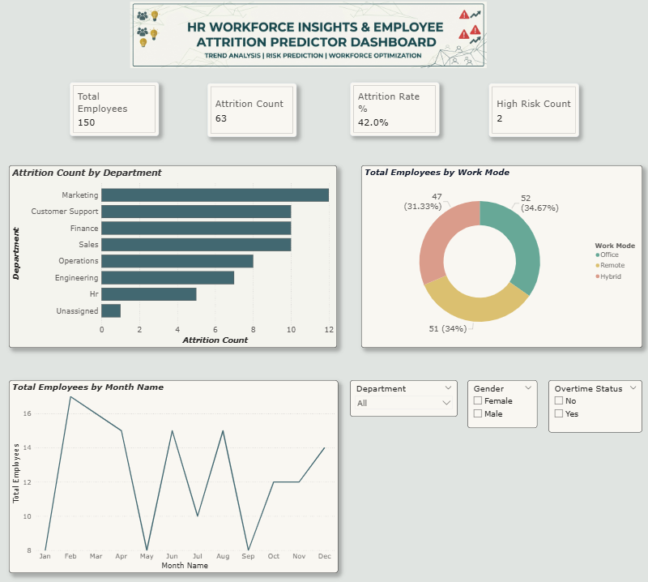

# 👥 HR Workforce Insights & Employee Attrition Predictor Dashboard

> **Author / Created By:** ELAVARASAN R
---



---

## 📌 Project Overview

A Power BI dashboard that tracks workforce composition and flags employees at risk of leaving — built to mirror how an HR analyst, people analytics team, or business leadership monitors attrition and plans retention strategy.

---

## 🎯 Objective

To turn raw HR records into four answers leadership actually needs:
1. **How big is our attrition problem**, and where is it concentrated?
2. **Which departments and job roles** need retention focus first?
3. **Are overtime, low satisfaction, or poor work-life balance** driving people out?
4. **Which currently-employed people** are at High risk of leaving next?

---

## 🏭 Industry Relevance

Modern enterprises, tech firms, and corporate HR teams rely heavily on People Analytics to reduce turnover costs, retain key talent, and improve employee satisfaction. This project provides an interview-ready, end-to-end workforce analytics solution designed to give HR business partners and executive leaders actionable insights into attrition risk drivers.

---

## 🛠️ Tools Used

- **Power BI Desktop** — Data modeling, DAX, dashboard visual layout design
- **Power Query** — Data cleaning, ETL transformations, Age/Experience banding
- **Microsoft Excel** — Source dataset featuring dynamic threshold formulas
- **DAX (Data Analysis Expressions)** — Attrition KPIs, satisfaction averages, and risk logic
- **GitHub** — Version control, portfolio hosting, and project documentation

---

## 📊 Dataset Description

`HR_Attrition_Dataset.xlsx` contains 150 employee records with 22 columns:

| Column | Description |
|---|---|
| Employee ID | Unique employee identifier |
| Employee Name | Employee's full name |
| Age | Employee age |
| Gender | Male / Female |
| Department | Sales, Engineering, HR, Finance, Marketing, Operations, Customer Support |
| Job Role | Specific role within the department |
| Education Level | High School / Bachelor's / Master's / PhD |
| Marital Status | Single / Married / Divorced |
| Location | Employee's city |
| Joining Date | Date the employee joined |
| Years at Company | (Analysis Date − Joining Date) ÷ 365 |
| Monthly Income | Monthly salary |
| Performance Rating | 1 (lowest) to 5 (highest) |
| Training Hours | Training hours completed |
| Overtime Status | Yes / No |
| Work Mode | Office / Hybrid / Remote |
| Job Satisfaction Score | 1–10 |
| Work-Life Balance Score | 1–10 |
| Promotion Last 2 Years | Yes / No |
| Absenteeism Rate | % of working days absent |
| Attrition Status | Yes (has left) / No (still employed) |
| Attrition Risk Level | Low / Medium / High (rule-based score driven by satisfaction, work-life balance, overtime, and promotions) |

`Years at Company` and `Attrition Risk Level` are live Excel formulas driven off an **Analysis Date** reference cell (`X2` set to `2026-01-01`).

A second file, `Raw_Dataset_Before_Cleaning.xlsx`, contains the same raw data before cleanup — deliberately containing null values, inconsistent text casing, extra whitespace, and duplicate rows for Power Query ETL walkthroughs.

---

## 🔄 Power Query Steps

See [`docs/POWER_QUERY_STEPS.md`](docs/POWER_QUERY_STEPS.md) for the full click-by-click walkthrough.
- **Null & Blank Handling:** Removed null records and imputed missing categorical labels.
- **Text Standardization:** Fixed irregular casing and trimmed extra whitespace.
- **Data Type Corrections:** Converted serial dates using explicit locale configurations (`DD/MM/YYYY`).
- **Feature Engineering:** Derived `Age Groups`, `Experience Bands`, and extracted `Joining Month/Year` fields.

---

## 🧮 DAX Measures & Calculations

See [`docs/DAX_MEASURES.md`](docs/DAX_MEASURES.md) for every measure with its formula and plain-language explanation. Key metrics include:
- **Total Employees:** `COUNT(HR_Data[Employee ID])`
- **Attrition Count:** `CALCULATE(COUNT(HR_Data[Employee ID]), HR_Data[Attrition Status] = "Yes")`
- **Attrition Rate %:** `DIVIDE([Attrition Count], [Total Employees], 0)`
- **Average Job Satisfaction:** `AVERAGE(HR_Data[Job Satisfaction Score])`
- **Average Work-Life Balance:** `AVERAGE(HR_Data[Work-Life Balance Score])`
- **High Attrition Risk Employees Count:** Calculated headcount of active employees in the `High` risk category.

---

## 🖥️ Dashboard Features & Architecture

- **Top Executive KPI Cards:** Instant metrics for `Total Employees`, `Attrition Count`, `Attrition Rate %`, `Average Satisfaction`, and `Average Income`.
- **Global Slicer Control Bar:** Cross-filtering across `Department`, `Gender`, `Work Mode`, `Risk Level`, and `Job Role`.
- **Departmental & Role Analytics:** Bar and column charts evaluating attrition headcount and rates across departments and job roles.
- **Work Dynamics Breakdown:** Stacked bar chart comparing attrition rates by `Work Mode` and `Overtime Status`.
- **Matrix Department Table:** Detailed `Department × Total Employees × Attrition Count × Attrition Rate %` auditing grid.

---

## 📁 Repository Structure

```text
hr-workforce-attrition-dashboard/
├── README.md
├── HR_Attrition_Dataset.xlsx
├── Raw_Dataset_Before_Cleaning.xlsx
├── HR-Workforce-Attrition-Dashboard.pbix
├── docs/
│   ├── POWER_QUERY_STEPS.md
│   ├── DAX_MEASURES.md
│   ├── PROJECT_OVERVIEW.md
│   ├── RESUME_DESCRIPTIONS.md
│   ├── LINKEDIN_CONTENT.md
│   └── PROJECT_CHECKLIST.md
└── screenshots/
    └── hr_workforce_dashboard1.png
